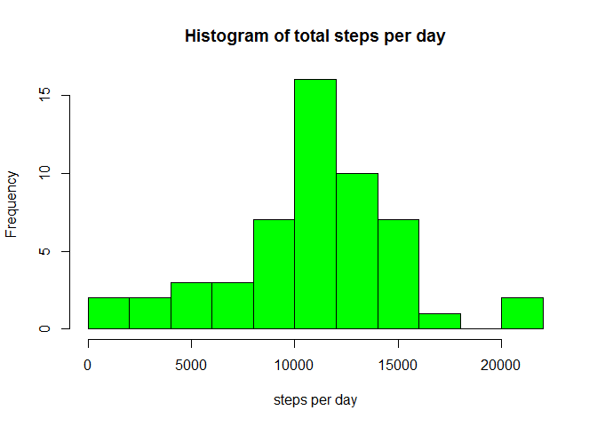
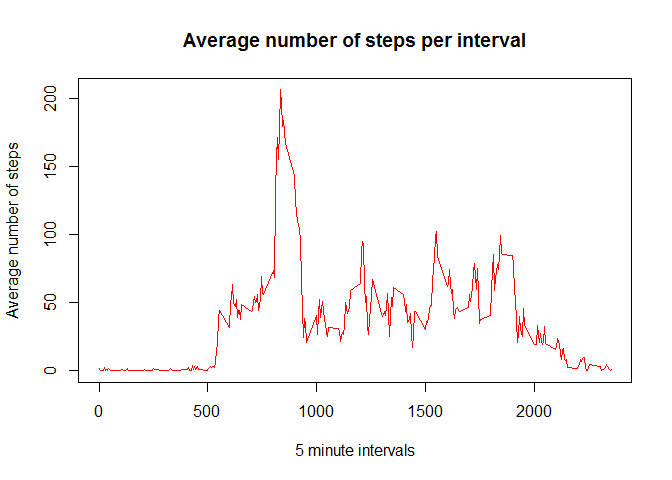
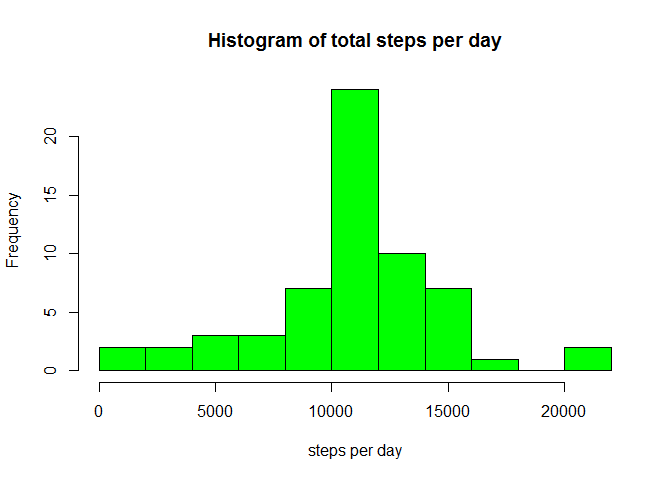
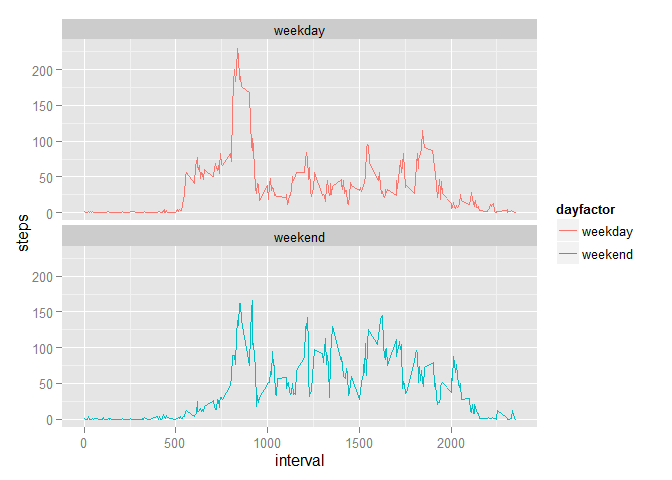

# Reproducible Research: Peer Assessment 1
Data analysis done as perscribed for the Coursera course on Reproducible Research. The data was provided with the original forked [GitHub repository](http://github.com/rdpeng/RepData_PeerAssessment1). This repository was forked on 7 July 2015 and this is the version that was used for the analysis.

This assignment makes use of data from a personal activity monitoring device. This device collects data at 5 minute intervals through out the day. The data consists of two months of data from an anonymous individual collected during the months of October and November, 2012 and include the number of steps taken in 5 minute intervals each day.

The variables included in this dataset are:

 - **steps:** Number of steps taken in a 5-minute interval (missing values are coded as NA)
 - **date:** The date on which the measurement was taken in YYYY-MM-DD format
 - **interval:** Identifier for the 5-minute interval in which measurement was taken 
 
There are a total of 17,568 observations in this dataset.

## Loading and preprocessing the data

1 *Load the data*

2 *Process/transform the data*

####1.  Load the data

The following libraries are used in this analysis.

```r
library(dplyr)
library(ggplot2)
```

The data for this analysis is provided in a compressed file: activity.zip. The zip file contains one file called activity.csv. This file can be read directly using the `unz` function. Using `read.table` with `header = TRUE` and `sep = ","` the content of the file is read into the `data` object. Since this operation is fast no caching is required. To avoid the dates being read as factors I include `stringsAsFactors = FALSE`.


```r
data <- read.table(unz("activity.zip", 
                       "activity.csv"), 
                   header = TRUE, 
                   sep = ",", 
                   stringsAsFactors = FALSE)
```

####2.  Process/transform the data

The only processing done is to transform the date column from character to date values. Further manupilation will be shown in the relevant sectors to maintain readability.


```r
data$date <- as.Date(data$date, "%Y-%m-%d")
```

## What is mean total number of steps taken per day?

1 *Calculate the total number of steps taken per day.*

2 *Make a histogram of the total number of steps taken each day.*

3 *Calculate the mean and median of the total number of steps taken per day.*

####1.  Calculate the total number of steps taken per day.

I use the `aggregate` function to calculate the total number of steps per day.


```r
TotalSteps <- aggregate(steps ~ date, data = data, sum)
```

####2.  Make a histogram of the total number of steps taken each day.

Using the basic plot function `hist` I draw a historgram of the total steps per day. I use `breaks = 8` which draws a similar diagram than the default option but highlights the interesting small spike above 2000 steps per day.


```r
hist(TotalSteps$steps,
     breaks = 8,
     main = "Histogram of total steps per day", 
     xlab = "steps per day", 
     col = "green")
```

 

####3.  Calculate the mean and median of the total number of steps taken per day.

Calculating the `mean` and `median` could use the similarly named functions. Displaying the summary of `TotalSteps` shows a bit more information.


```r
StepSummary <- summary(TotalSteps)
StepsMean <- StepSummary[4,2]        # mean(StepSummary$Steps)
StepsMedian <- StepSummary[3,2]      # median(StepSummary$Steps)

StepSummary
```

```
##       date                steps      
##  Min.   :2012-10-02   Min.   :   41  
##  1st Qu.:2012-10-16   1st Qu.: 8841  
##  Median :2012-10-29   Median :10765  
##  Mean   :2012-10-30   Mean   :10766  
##  3rd Qu.:2012-11-16   3rd Qu.:13294  
##  Max.   :2012-11-29   Max.   :21194
```

The calculated mean and median of the total steps per day.

 - **Mean   :10766  ** 
 - **Median :10765  **


## What is the average daily activity pattern?

1 *Create a time series plot.*

2 *Calculate the maximum steps in any interval.*

####1.  Create a time series plot.

Make a time series plot of the 5-minute interval and the average number of steps taken, averaged across all days.

I use tapply to calculate the average (`mean`) number of steps for each interval accross all the days.

The time series plot is generated using the basic plot function with `type = "l"`.


```r
IntervalSteps <- tapply(data$steps, data$interval, mean, na.rm = TRUE)

plot(row.names(IntervalSteps), 
     IntervalSteps, 
     type = "l",
     col = "red",
     xlab = "5 minute intervals",
     ylab = "Average number of steps",
     main = "Average number of steps per interval")
```

 


####2.  Calculate the maximum steps in any interval.

Which 5-minute interval, on average across all the days in the dataset, contains the maximum number of steps?

In the IntervalSteps object the intervals are represented by the column names. So I find the max interval using a combinations of `names` and `which.max` to find the interval with the highest value.


```r
names(which.max(IntervalSteps))
```

```
## [1] "835"
```

## Imputing missing values

1 *Calculate the total number of missing values in the dataset.*

2 *Strategy for filling in all of the missing values in the dataset.*

3 *Create a new dataset that is equal to the original dataset but with the missing data filled in.*

4 *Create histogram of 'updated' total number of steps taken each day.*

####1.  Calculate the total number of missing values in the dataset.

Since the `sum` function will evaulate `TRUE` as 1 and `FALSE` as 0 I simply `sum` the result of `is.na` to calculate the number of missing values in the dataset.


```r
sum(is.na(data$steps))
```

```
## [1] 2304
```

That is roughly 13% missing values.

####2.  Strategy for filling in all of the missing values in the dataset.

The assignment states that the strategy devised to calculate the missing values does not need to be sofisticated. I therefore ignore differences between weekdays and weekends as well as outliers or the surrounding values. I will simply check the steps for each observation and replace any NA values with the mean value for that interval based on the previously calculated IntervalSteps. The result is stored in a numeric verctor called `ImputeNA`


```r
ImputeNA <- numeric()
for (i in 1:nrow(data)) {
    observation <- data[i, ]
    if (is.na(observation$steps)) {
        steps <- IntervalSteps[[as.character(observation$interval)]]
    } else {
        steps <- observation$steps
    }
    ImputeNA <- c(ImputeNA, steps)
}
```
*This code turns out to be fairly slow - in future consider using tapply or the dplyr library. Alternatively implement caching.*


####3.  Create a new dataset that is equal to the original dataset but with the missing data filled in.

Create a copy of the original data called `ImputeData`. Replace the steps data with `ImputeNA`.


```r
ImputeData <- data
ImputeData$steps <- ImputeNA 
```

####4.  Create histogram of 'updated' total number of steps taken each day.

 - Make a histogram of the total number of steps taken each day.
 - Calculate the mean and median total number of steps taken per day.
 - Do these values differ from the estimates from the first part of the assignment?
 - What is the impact of imputing missing data on the estimates of the total daily number of steps?
 
 This is simply a repeate of the first analysis done with the original data set. This time using the dataset with the imputed values.
 

```r
TotalStepsI <- aggregate(steps ~ date, data = ImputeData, sum)

hist(TotalStepsI$steps,
     breaks = 8,
     main = "Histogram of total steps per day", 
     xlab = "steps per day", 
     col = "green")
```

 
 

```r
StepSummaryI <- summary(TotalStepsI)
StepsMeanI <- StepSummaryI[4,2]        # mean(StepSummary$Steps)
StepsMedianI <- StepSummaryI[3,2]      # median(StepSummary$Steps)

StepSummaryI
```

```
##       date                steps      
##  Min.   :2012-10-01   Min.   :   41  
##  1st Qu.:2012-10-16   1st Qu.: 9819  
##  Median :2012-10-31   Median :10766  
##  Mean   :2012-10-31   Mean   :10766  
##  3rd Qu.:2012-11-15   3rd Qu.:12811  
##  Max.   :2012-11-30   Max.   :21194
```

The calculated mean and median of the total steps per day.

 - **Mean   :10766  ** 
 - **Median :10766  **
 
The Mean is the same as previously calculated which makes sense based on the strategy to replace missing values with the mean for that time interval. The Median changed to be the same as the mean which also makes sense based on the number of values "mean" values added to the dataset.

The impact on the mean and median values are minimal. The shape of histogram also remained the same, but the frequency counts increased.
 
## Are there differences in activity patterns between weekdays and weekends?

1  *Create a new factor variable in the dataset with two levels indicating "weekday" or "weekend".*

2 *Make a panel plot containing a time series plot of the 5-minute interval (x-axis) and the average number of steps taken, averaged across all weekday days or weekend days.*

####1. Create a new factor variable in the dataset with two levels indicating "weekday" or "weekend".

Using the `mutate` function from the `dplyr` package combined with `ifelse` makes it easyto add a factor vector to the imputed data frame.


```r
ImputeData <- ImputeData %>% 
    mutate(dayfactor = ifelse(weekdays(date) %in% c("Saturday", "Sunday"), "weekend", "weekday"))
```

####2. Make a panel plot containing a time series plot of the 5-minute interval (x-axis) and the average number of steps taken, averaged across all weekday days or weekend days.

For the panel plot allowing comparison of daily activity between weedays and weekend days aggregating the data is easier using `group_by` and `summarise`.


```r
which_day <- ImputeData %>% 
    group_by(interval, dayfactor) %>%
    summarise(steps = mean(steps))
```

I will use the ggplot2 system to plot the panel plot by using facets.


```r
s <- ggplot(which_day, aes(x=interval, y=steps, color = dayfactor)) +
    geom_line() +
    facet_wrap(~dayfactor, ncol = 1, nrow=2)
print(s)
```

 


